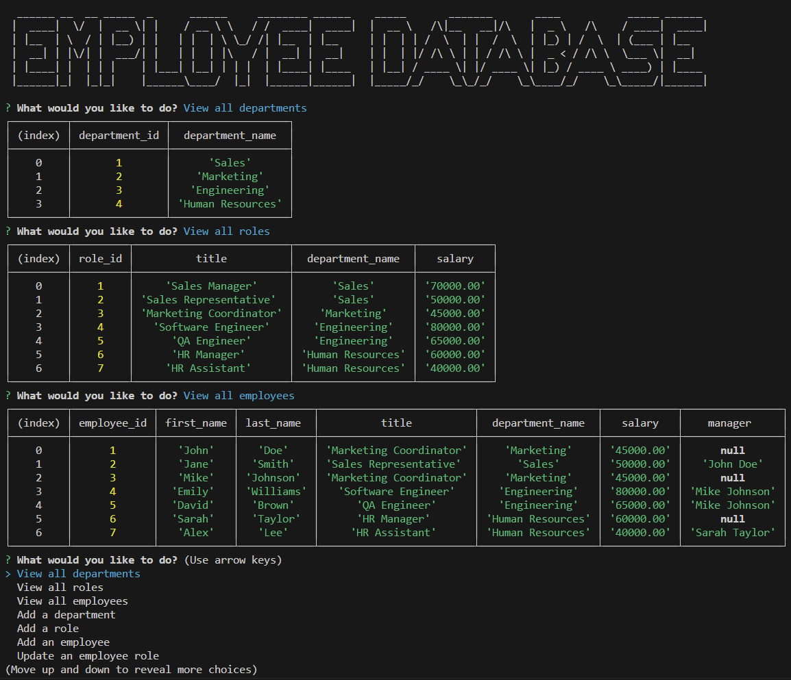

# SQL-Employee-CMS

## Description

This is an employee database that contains info for roles, departments, and employee information. It allows you to add or delete info from those tables and show individual table info.

## Screenshot

## Link

Video link showing application working: https://drive.google.com/file/d/1xtiJX4AgMs2hO0t6GaYxB1Vdi793xTbK/view